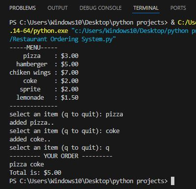

# Restaurant Ordering System (Python)

## Overview
A command-line restaurant ordering system written in Python that allows
users to select items from a predefined menu, add them to a cart, and
calculate the total cost.

## Features
- Menu-based item selection
- Input validation
- Shopping cart and total price calculation

## What I Learned
- Using dictionaries to map items to prices

